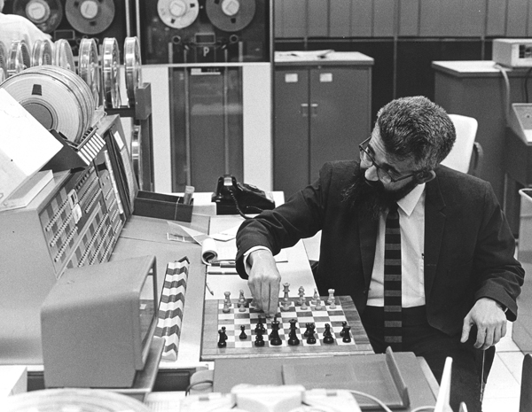
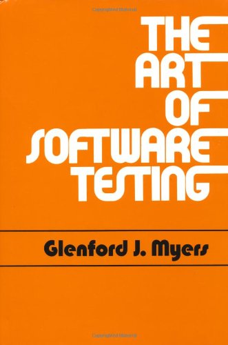
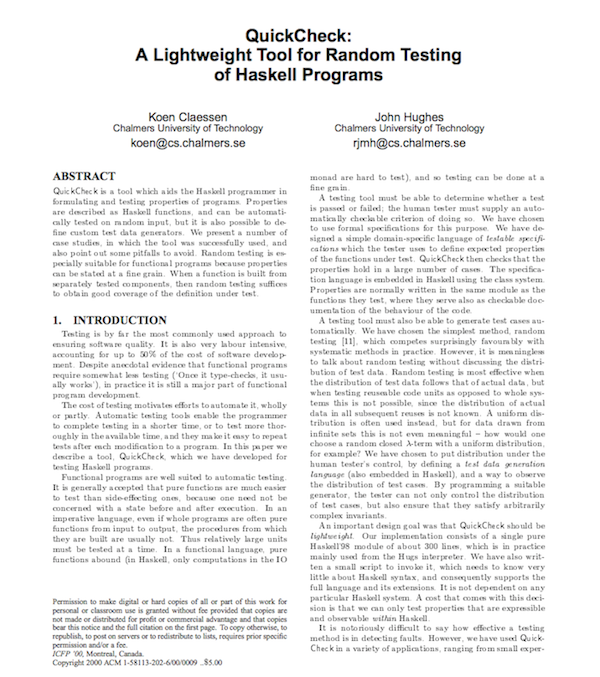
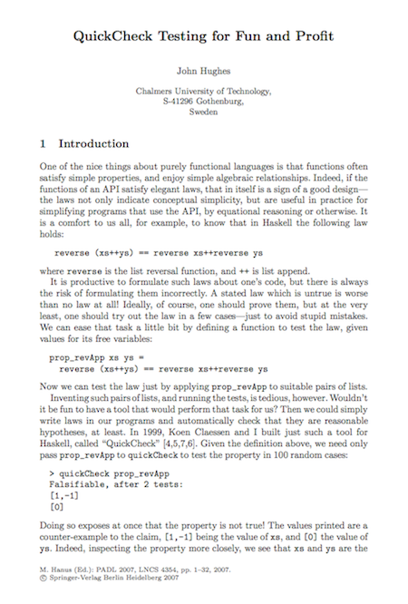
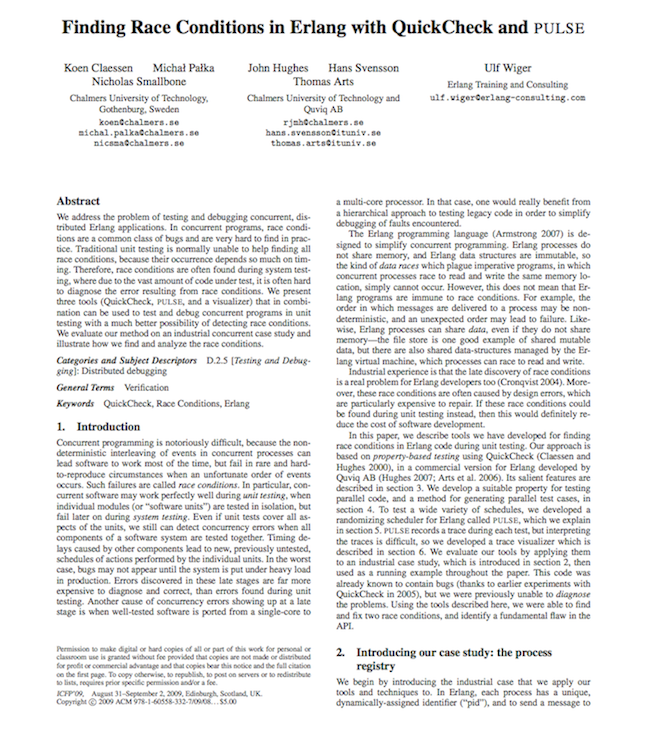

# Composing Test Generators

# Who Am I?

### Zeeshan Lakhani

### programmer at Beatport/SFX/Arc90

### a lead organizer of Papers We Love - [@paperswelove](https://twitter.com/papers_we_love)

### [@zeeshanlakhani](https://twitter.com/zeeshanlakhani)

### [github.com/zeeshanlakhani](https://github.com/zeeshanlakhani)

### what I listened to while preparing this talk


<http://bit.ly/U2FUpx>

# What We'll Cover

### Background - Tests, Property-Based Testing

### Generation from a Data Validation Layer

-   Prismatic Schema

### Case Study - Making My Job Easier

#### More Definitive [Talk](http://www.midwest.io/sessions/#tuesday-6a) on Property-Based Testing - [Jessica Kerr](http://blog.jessitron.com/)

# Where It All Starts&#x2026;


<http://www.amazon.com/Clojure-Bookshelf/lm/R3LG3ZBZS4GCTH>

# 

# Beginnings



<http://bit.ly/1zzylYo>

# [Koen Claessen & John Hughes](http://www.cs.tufts.edu/~nr/cs257/archive/john-hughes/quick.pdf)



<http://bit.ly/1q8A7hn>

# [Fun and Profit](http://people.inf.elte.hu/center/fulltext.pdf)



<http://bit.ly/1sbLMvz>

# [More Recent - Erlang - PULSE](http://www.cse.chalmers.se/~nicsma/papers/finding-race-conditions.pdf)



<http://bit.ly/1r923kA>

# From the Paper

> We have designed a simple domain-specific language of
> testable specifications which the tester uses to
> define expected properties of the functions under test.

> We have chosen to put distribution under the human tester's
> control, by defining a test data generation language&#x2026;

> We have taken two relatively old ideas, namely specifications
> as oracles and random testing, and found ways to make them
> easily available &#x2026;

# The Idea

> The idea of property-based testing is to write a specification
> of the system under test in a suitable language, which is then
> tested using a large collection of test data invented by the
> computer

<http://www.cse.chalmers.se/~nicsma/papers/lic.pdf>

# Why Do We Test and How?


<http://unbounce.com/photos/abt2.png>

One Feature - O(n)

Pairs of Features - O(n<sup>2</sup>) - quadratic

Triples of Features - O(n<sup>3</sup>) - cubic

# Big Statement about Testing?


<http://bit.ly/1xRTmfg>

# This One, That One

<http://stackoverflow.com/a/17810004/413685>

### Dummy objects

are passed around but never actually used.

### Fake objects

actually have working implementations, but usually take some shortcut
which makes them not suitable for production (an in memory database
is a good example).

### Stubs

provide canned answers to calls made during the test&#x2026;

### Mocks

are objects pre-programmed with expectations which form a specification
of the calls they are expected to receive.

#### testing(Integration - Functional - Regression - Validation - Acceptance)

# Bias - Forgetful - Redundant - Tedious

```clj
;; Example
(deftest test-post
    (with-system
    (let [config (load-config)
            port (:http-server-port config)
            chart-to-create
            {:slug "foo-bar-baz"
            :name "Foo Bar Baz"
            :description {:en "foo"}
            :duration-seconds 100
            :created-by {:url "/accounts/brianolssen"}
            :media [{:url "/tracks/baby-monkey"} {:url "/videos/oh-my-dayum"}]}
            req {:accept :json
                :throw-exceptions false
                :content-type "application/json"
                :basic-auth ["brianolssen" "iF41ixXSUntFoXirPAXJ"]
                :body (json/encode chart-to-create)}
            path (route port :charts)]
        (testing "Post chart";; ...))))
```

# Property-Based Testing -> Establishing Invariants in Code

# Or Maybe A Better Title?

# [Generating Circumstances](http://alexey.radul.name/ideas/2014/testing-revisited/)

# Examples

# Specification - The Transpose of a Transposed Matrix is the Original Matrix

(A<sup>T</sup>)<sup>T</sup> = A

```clj
(def matrix-gen
    (gen/such-that
    not-empty
    (gen/vector
    (gen/tuple gen/int gen/int gen/int))))

(gen/sample matrix-gen 10)
```
**Results**

```clj
([[0 0 1]]
 [[0 -1 0]]
 [[0 2 1] [0 1 -2]]
 [[1 0 1] [0 1 -3] [0 4 2] [2 -3 4]]
 [[-3 5 -4] [3 -3 -2] [-2 3 -2] [-3 -5 -3] [0 -3 -1]]
 [[2 -5 -3] [-4 -3 5] [-4 -3 -4] [-4 4 3]]
 [[-4 4 5] [-4 2 0] [5 -6 0] [2 -3 5] [-6 -3 -5]]
 [[-5 2 -3] [-2 -2 5]]
 [[-1 3 -5] [5 -3 -2] [7 4 -7] [7 -3 -2] [1 -3 8]]
 [[-5 -3 -3] [2 7 -3]])
```
----

```clj
(def matrix
    [[1 2]
    [3 4]])

(transpose matrix)
```

**Results**

```clj
[[1 3] [2 4]]
```
----

```clj
(def transpose-of-transpose-prop
    (prop/for-all [m matrix-gen]
    (= m (transpose (transpose m)))))

(quick-check 50 transpose-of-transpose-prop)
```

**Results**
```clj
{:result true, :num-tests 50, :seed 1405444353915}
```

# Failure & Shrinking

[Example From Clojure Cookbook](http://bit.ly/1kmjKFY)

```clj
(defn reciprocal-sum [s]
    (reduce + (map (partial / 1) s)))

(reciprocal-sum '(1 2))
```

**Results**
```clj
3/2
```
----

```clj
(def numbers
    (gen/fmap #(filter even? %)
    (gen/one-of [(gen/vector gen/int)
                (gen/list gen/int)])))

(gen/sample numbers)
```

**Results**
```clj
(() (0) (0 0) () (0 4) (4) () (-4 -4) (0) ())
```
----

```clj
(def reciprocal-sum-check
    (prop/for-all [s numbers]
    (number? (reciprocal-sum s))))

(quick-check 100 reciprocal-sum-check :max-size 300)
```

**Results**
```clj
{:result
 #<ArithmeticException java.lang.ArithmeticException: Divide by zero>,
 :seed 1405444683133,
 :failing-size 6,
 :num-tests 7,
 :fail [(-2 -2 6 -2 0)],
 :shrunk
 {:total-nodes-visited 8,
  :depth 5,
  :result
  #<ArithmeticException java.lang.ArithmeticException: Divide by zero>,
  :smallest [(0)]}}
```

# Concurrency - Race Conditions

- [current-status-thread](https://groups.google.com/forum/#!topic/clojure-dev/GhG-PbKW_ew)

- [test.check w/ knossos to find concurrency bugs](https://github.com/philandstuff/test-check-knossos)

- [verifies linearizability](https://github.com/aphyr/knossos) -
    place–or the appearance of a place–where every
    operation happens in a nice linear order

- [with-redefs-fn](http://clojuredocs.org/clojure_core/clojure.core/with-redefs-fn) -
    redefine a set of clojure concurrency functions

# [schema->gen](https://github.com/zeeshanlakhani/schema-gen)

### Data Validation - Runtime

```clj
(def LookAtData
    {:foo                     s/Int
    :baz                     [s/Str]
    :bar                     s/Bool
    (s/optional-key :pirate) s/Keyword})

(s/validate LookAtData {:foo 1 :baz ["Hey"] :bar false})
```

**Results**
```clj
{:baz ["Hey"], :bar false, :foo 1}
```
----

```clj
(s/check LookAtData {:foo 1 :bar false :pirate :jj})
```

**Results**
```clj
{:baz missing-required-key}
```

# Vector of Specific, Optional, and Generated Values

```clj
(def s-vector
  [(s/one s/Bool "first") (s/one {s/Keyword s/Bool} "second")
   (s/optional s/Keyword "maybe") s/Int])

(gen/sample (schema->gen s-vector) 10)
```

**Results**
```clj
((false {} :Q)
 (false {} :i -1)
 (true {})
 (true {} :!5? -2)
 (true {:MRK* true, :+E false} :ayG 2 -3 -1)
 (false
  {:qF_+OU true, :+!-2 true, :c*9-+ true, :!K_Jn4 false, :Z4eE true})
 (true {})
 (true
  {:+D* true,
   :AFrGr false,
   :*Y_D3U false,
   :M_T93Q_ false,
   :p+! false,
   :y!n!qbs false})
 (true {:!R4? true, :c_ true, :Fe!1i_! false})
 (false
  {:?F7 true,
   :W!? true,
   :!?!X*-_*4? false,
   :L false,
   :MS1y-TTQ false,
   :s9+0-E__58 false,
   :G7je?_ true,
   :Y0 false}
  :+KEQKDYs))
```

# Hashmap for Validation on Key-Vals (Requests)

```clj
(def s-hashmap
  {:foo s/Int
   (s/optional-key :midwestio) s/Bool
   :baz [s/Str]
   :bar s-vector
   :bugz #"^[a-z0-9][a-z0-9\-]{0,40}$"
   s/Keyword s/Num})

(gen/sample (schema->gen s-hashmap) 10)
```

**Results**
```clj
({:foo 0,
  :baz (),
  :bar (false {} :t),
  :bugz "s5-lyfvxe5vhdiuse8i7ywhkiz6f33wyx03dak",
  :midwestio false}
 {:foo 0, :baz (), :bar (true {} :J9 0), :bugz "1d84igmu39"}
 {:foo 1,
  :baz ("{" ""),
  :bar (true {:*s true, :L!Y true} :*y -1 1),
  :bugz "3ijs4ve0k1evk-utumf4ycxflsx8",
  :midwestio true}
 {:foo -2,
  :baz (),
  :bar (false {:pZ true, :M true, :O7Y2 true} :GX?Q -2 -2),
  :bugz "nchl2a3d54quv7su4rtyz-1xjf-sjg-i8",
  :F1+4 -0.5,
  :CY 0.25,
  :T -3.0}
 {:foo 4,
  :baz ("rQ" "FkQk"),
  :bar (true {:mg*UL false, :t72 true, :f?y true} :-o 0 -3),
  :bugz "cf0d0ql3o1clj6v8jfiko80o6jfu7-zwpg85n",
  :- 2.0,
  :?zn2 0.8}
 {:foo 5,
  :baz (),
  :bar (false {:k true} :Q5e -3 1 -3),
  :bugz "twci5io7l8hc-jk3wsamta",
  :*_* 0.25}
 {:foo -5,
  :baz (),
  :bar
  (false
   {:G2*!cu9 true,
    :!!_ true,
    :w true,
    :_8P1-!4 true,
    :Md*C_0 false,
    :N!84+ true}),
  :bugz "w",
  :-D 1.5,
  :-+ 3.0,
  :badR-Ib 0.0,
  :midwestio false}
 {:foo 7,
  :baz (),
  :bar
  (true {:T-_ true, :CagQ true, :j?8+*JtG false, :? false} :?*! 0),
  :bugz "4utw18doyt7v8-k48fa"}
 {:foo -5,
  :baz (),
  :bar
  (false
   {:S??U true,
    :K false,
    :d07 true,
    :r false,
    :GN--wXJf true,
    :-cFO!+ true,
    :!69D6S false,
    :M64MYzVT* false}
   :yw2CWw-3
   -1
   -3
   4
   8
   -8
   2
   -5
   4),
  :bugz "4yy2towlj6g9k",
  :?+U4H- 0.2,
  :Ok!-?_+_+ 1.0,
  :iE1X**9W6 6.0,
  :?5 0.5714286,
  :Du3D 2.6666667}
 {:foo 0,
  :baz (),
  :bar
  (true
   {:*+q3 false,
    :E?i+?34+2 true,
    :U4XkD true,
    :-Pz_933 false,
    :_*Nnm??kcd true,
    :- true,
    :u7_VuR*5* true,
    :!f_ false,
    :x72_ false}),
  :bugz "y5vc6hu",
  :_1 -1.1666666,
  :V_6ncBoH 0.33333334,
  :?1S?Z 1.0,
  :midwestio false})
```

# Conversion

### MultiMethods Allow for Multiple Dispatch (runtime polymorphism)

```clj
;; Example

(defmulti schema->gen  identity)
(defmulti schema->gen* class)

(defmethod schema->gen s/Bool
  [_]
  (gen/elements [true false]))

(defmethod schema->gen* schema.core.Maybe
  [e]
  (gen/one-of
   [(gen/return nil)
    (schema->gen (:schema e))]))

(defmethod schema->gen* ::gen-map
  [e]
  (let [required (for [[k v] e
                       :when (or (keyword? k)
                                (instance? schema.core.RequiredKey k))]
                   [k v])
        rest (apply dissoc e (map first required))
        [optional [repeated]] (split-with
                               (fn [[k v]]
                                 (instance? schema.core.OptionalKey k))
                               rest)]
    (g/apply-by
     (partial apply merge)
     (g/apply-by
      (partial into {})
      (map optional-key-gen optional))
     (if repeated
       (->> repeated (map schema->gen) (apply gen/map))
       (gen/return {}))
     (apply gen/hash-map
            (mapcat (fn [[k v]]
                      [k (schema->gen v)])
                    required)))))
```

# Case Study - What We Did (& continue to do)

### [Using Clojure at Scale](http://bit.ly/1r92Jqh) - Living in a Dynamic World

### [Declarative Data Description and Validation](https://github.com/Prismatic/schema)

# Specification - Do Our Web Services Work?

### Are the Rules Specified **Always** True

#### Typical Process for a Client Apps Interacting w/ our Service Tier

##### Make a request on a collection -> GET back a collection of results

##### Pick a result, make an update to it

##### Expect to GET that result later w/ the updates made

# KINDA BORING STUFF&#x2026; Yet

# Property-Test Macros

```clj
;; Example

(defmacro test-put-gen
  {:requires [#'with-system config/load-config s/check http/get http/put
              #'valid! #'prop/for-all ugen/generate]}
  [{:keys [status resource-type ids schema resource-gen req-overrides]}]
  `(prop/for-all
    [gen# (ugen/generate ~schema ~resource-gen)]
    (with-system
      (let [cfg# (config/load-config)
            id# (rand-nth ~ids)
            path# (route (:http-server-port cfg#) ~resource-type id#)
            res# #(http/get path# common-req-get)
            source# #(get-body (res#))
            prop# (merge
                   (select-keys (source#) (:removes* ~resource-gen))
                   gen#)
            put-resp# (atom nil)
            continue# (atom true)]
        ;; Create our Generated Data & Validate
        (testing (str "Validate Generated " (name ~resource-type))
          (if-not (is (~'validates? ~schema prop#))
            (valid! ~schema prop#)
            (swap! continue# (constantly false))))
        ;; Make a PUT Request w/ this Data
        (when @continue#
          (testing "Test Put w/ Sampled Data, Check Status"
            (let [res# (http/put
                        path#
                        (put-post-body
                         (merge common-req-put ~req-overrides) prop#))]
              (if (is (= 200 (:status res#)))
                (swap! put-resp# (constantly (get-body res#)))
                (swap! continue# (constantly false))))))
        (when @continue#
          (testing "Validate Put Response"
            (when (is (~'validates? ~schema @put-resp#))
              (swap! continue# (constantly false)))))
        (when @continue#
          (testing "New Get Response Matches Previous Put Response"
            (let [res*# (res#)
                  get-resp# (get-body res*#)]
              (when (is (= 200 (:status res*#)))
                (is (= @put-resp# get-resp#))))))))))
```

# "Multi-Pass" Generation

### Applying Custom Generators & Additional Tuning

```clj
;; Example

;; What Current Schema Looks Like
(def Account-Existing
  (assoc Account-Base
    :primary-lang sc/Language
    :biography c/Localized-Map
    :handle c/Handle
    :prior-handles [c/Handle]
    ;;:roles Account-Roles
    :created-at sc/ISO-Date-Time
    :images c/Images
    :homepage (s/maybe c/Simple-Link)
    :agency (s/maybe Account-Link)
    :agent (s/maybe Account-Link)
    :location (s/maybe Account-Location)))

(defn account-gen
  {:requires [s/check]}
  []
  (let [check-merge (:check-merge ugen/gen-ops)
        vector-merge (:vector-merge ugen/gen-ops)]
    {:biography ugen/localized-map
     :name ugen/non-empty-string
     :primary-lang ugen/language
     :removes* [:url :created-at :location :handle]
     :injections* {:agency (ugen/account-link-injection
                            check-merge :put)
                   :agent (ugen/account-link-injection
                           check-merge :put)
                   :homepage (ugen/url-only-injection
                              check-merge nil urls)
                   :images (ugen/url-only-injection
                            vector-merge nil images)}}))

;; Example only
;; Under the Hood
(defn generate
  "Generates a sampled set of data, combining schema->gen
  and custom generators.
  It also randomizes which fields, if optional types, may or
  may not be on a request."
  [schema gen-map]

  (comment
    "gen-map conforms to a hash-map with
    customized keyword-gens {:foo gen}, removals, and injections,
    e.g."

    {:biography non-empty-string
     :name non-empty-string
     :primary-lang language
     :removes [:field1 :field2]
     :injections* {:genmap
                   {:field3 #(gen/return "foo")}
                   :ops (:vector-merge gen-ops)}}

    "Injections allow for the ability to *inject* generators into
    previously generated data-responses. An injection needs the required
    keys *genmap* and *ops*; *genmap* values are functions.")

  (let [schema* (rename-keys schema (:non-optional* gen-map))
        samp (comp last doall gen/sample)
        opts (find-optional-keys schema*)
        gen-map-opts (rename-keys gen-map opts)
        removes-ks (:removes* (random-update-removals gen-map (keys opts)))
        removes-ks-opts (map #(s/optional-key %) removes-ks)
        m (walk/postwalk
           #(if (map? %)
              (-> (apply dissoc % (apply conj
                                        removes-ks
                                        removes-ks-opts))
                 (c/update-in-if-exists
                  (keys gen-map-opts)
                  ;; set default values for what will be custom gens
                  ;; java - number placeholder
                  (fn [_ _] java.lang.Number)))
              %) schema*)
        injections (apply dissoc (:injections* gen-map) removes-ks)
        ;; generation on basic, non-custom types
        init-gen (schema->gen m)]
    (gen/fmap (fn [m]
                (walk/postwalk
                 #(if (map? %)
                    (-> (c/update-in-if-exists
                        %
                        (keys gen-map)
                        (fn [_ k] (samp (k gen-map))))
                       (c/update-in-if-exists
                        (keys injections)
                        (fn [v k]
                          (when v (-> v
                                     (inject-gen
                                      (get-in injections [k :genmap])
                                      (get-in injections [k :ops]))
                                     samp))))) %) m)) init-gen)))
```

# Live(Live) Demo

# Other Uses

## Just the Generators, not the Tests

-   Sample Data Population

### Query-Param Generation

### Generate Error, Check Our Responses

### Elasticsearch Scoring Property Tests

# Types at Work - Eventually

### schema - core.typed - generators

# Conclusion

### Don't Write Tests, Generate Them

# Things and Links

- [pinboard - zeeshanlakhani - midwestio](https://pinboard.in/u:zeeshanlakhani/t:midwestio/)

- emacs'ian things used
    - [org-mode](https://github.com/jwiegley/org-mode)
    - [thing-babel](https://github.com/thi-ng/babel)
    - [org-present](https://github.com/rlister/org-present)
